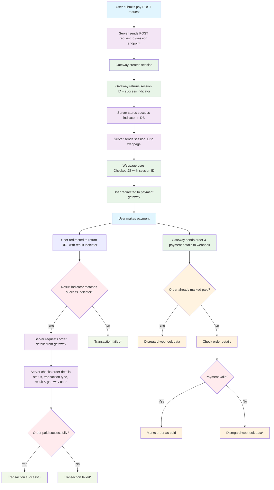

```mermaid
flowchart TD
    A[User submits pay POST request] --> B[Server sends POST request to /session endpoint]
    B --> C[Gateway creates session]
    C --> D[Gateway returns session ID + success indicator]
    D --> E[Server stores success indicator in DB]
    E --> F[Server sends session ID to webpage]
    F --> G[Webpage uses CheckoutJS with session ID]
    G --> H[User redirected to payment gateway]
    H --> I[User makes payment]
    I --> J[User redirected to return URL with result indicator]
    J --> K{Result indicator matches success indicator?}
    K -->|Yes| L[Server requests order details from gateway]
    K -->|No| M[Transaction failed*]
    L --> N[Server checks order details status, transaction type, result & gateway code]
    N --> O{Order paid successfully?}
    O -->|Yes| P[Transaction successful]
    O -->|No| Q[Transaction failed*]
    
    %% Parallel webhook flow
    I --> R[Gateway sends order & payment details to webhook]
    R --> S{Order already marked paid?}
    S -->|Yes| T[Disregard webhook data]
    S -->|No| U[Check order details]
    U --> V{Payment valid?}
    V -->|Yes| W[Marks order as paid]
    V -->|No| X[Disregard webhook data*]
    
    %% Styling
    classDef userAction fill:#e1f5fe
    classDef serverAction fill:#f3e5f5
    classDef gatewayAction fill:#e8f5e8
    classDef webhookAction fill:#fff3e0
    classDef decision fill:#ffebee
    classDef outcome fill:#f1f8e9
    
    class A,I userAction
    class B,E,F,L,N serverAction
    class C,D,G,H,R gatewayAction
    class S,U,T,W,X webhookAction
    class K,O,V decision
    class P,Q,M outcome
```
